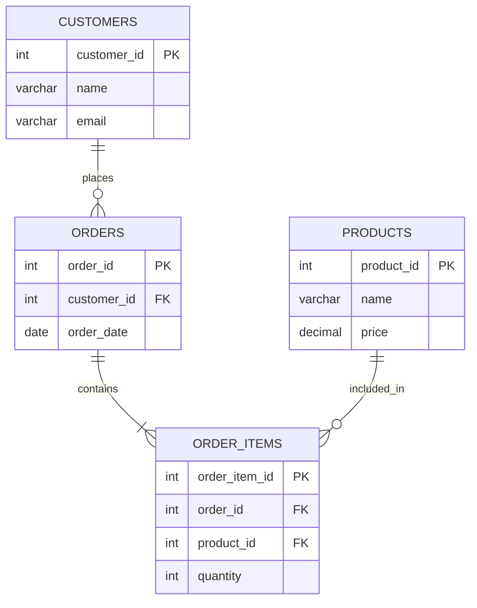
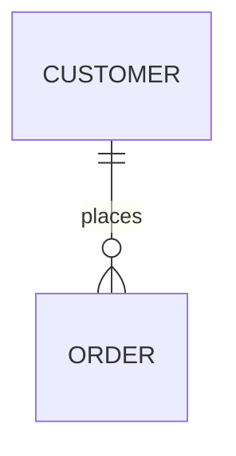
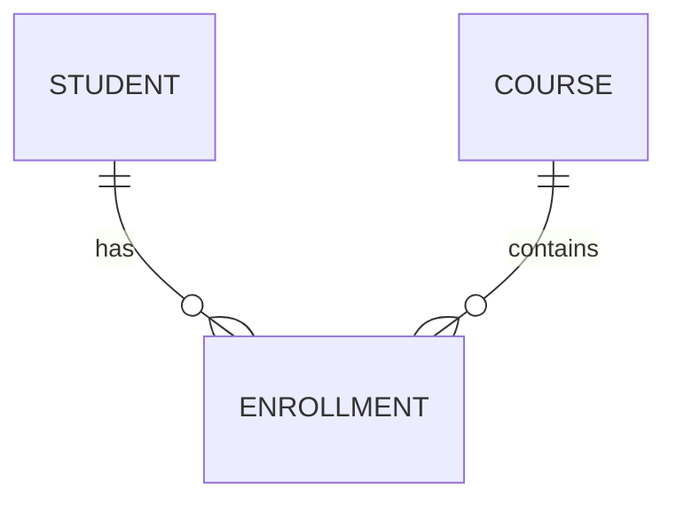
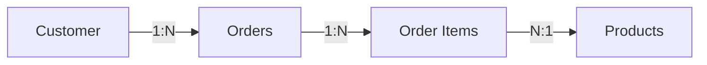
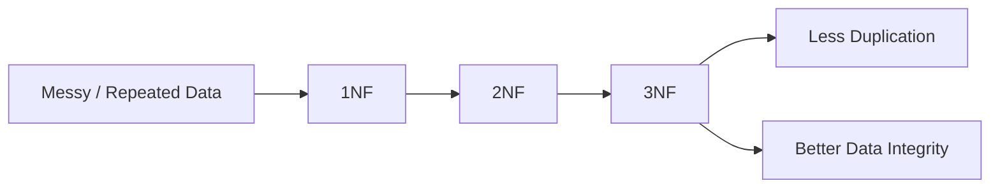
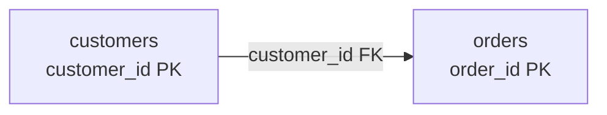
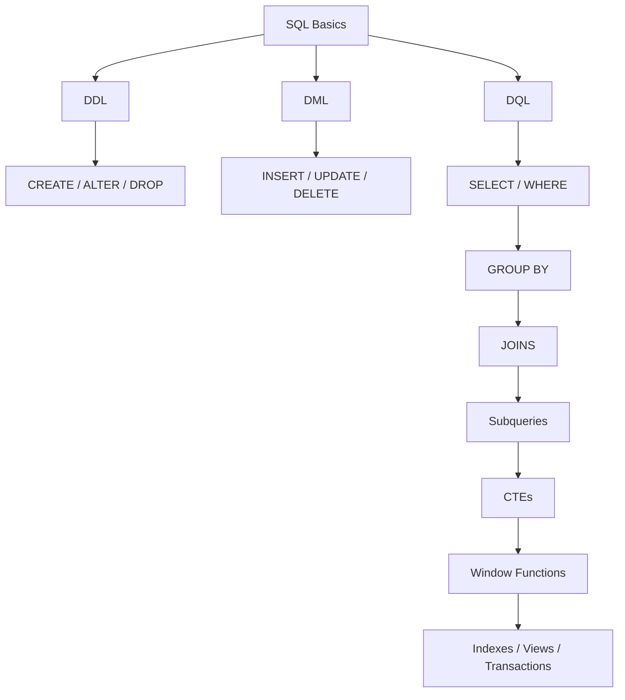

# ER DIAGRAM
## Table of Contents

- [Quick Definition](#quick-definition)
- [Beginner — Customer and Orders](#beginner-customer-and-orders)
- [Intermediate — E-Commerce ERD](#intermediate-e-commerce-erd)
- [Advanced — Complete Example](#advanced-complete-example)


## Quick Definition

An **ER Diagram (Entity-Relationship Diagram)** is a visual representation of a database structure. It shows **entities (tables), their attributes (columns), and relationships between entities**.

Before writing SQL, an ER diagram helps you see how the database should be structured.

### The Basic Idea

Think of an ER diagram as a **blueprint for your database**.

Before building a house, you draw the blueprint. Before creating a database with 30 tables and a pile of foreign keys, you draw the relationships.

For an e-commerce system:

```text
Customers
    │
    │ 1:N
    ↓
 Orders
    │
    │ 1:N
    ↓
Order Items
    ↑
    │ N:1
 Products
```

This tells you:

* One customer can have many orders.
* One order can have many order items.
* Each order item belongs to one product.

---

# Main Components

An ER diagram has three important parts:

```text
Entity
  ↓
Attribute
  ↓
Relationship
```

### 1. Entity

An **entity** represents something you store information about.

In a relational database, an entity usually becomes a table.

Examples:

```text
Customer
Order
Product
Employee
Department
Student
Course
```

For example:

```text
CUSTOMER
----------------
customer_id
name
email
```

`CUSTOMER` is the entity.

---

### 2. Attribute

An **attribute** describes an entity.

In SQL, attributes normally become columns.

```text
CUSTOMER
----------------
customer_id
name
email
phone
```

Here:

```text
customer_id → attribute
name        → attribute
email       → attribute
phone       → attribute
```

The primary key is normally identified separately in an ER diagram.

```text
CUSTOMER
----------------
PK customer_id
   name
   email
```

`PK` means **Primary Key**.

---

### 3. Relationship

A relationship describes how two entities are connected.

Example:

```text
CUSTOMER ───── places ───── ORDER
```

In database terms:

```text
customers.customer_id
        ↓
orders.customer_id
```

The relationship also has **cardinality**, which tells you how many records can be connected.

---

# Cardinality

Cardinality is one of the most important parts of ER diagrams.

The three major relationship types are:

```text
1 : 1
1 : N
M : N
```

### One-to-One

```text
USER 1 ───────── 1 PROFILE
```

One user has one profile.

### One-to-Many

```text
CUSTOMER 1 ───────── N ORDER
```

One customer can have many orders.

### Many-to-Many

```text
STUDENT M ───────── N COURSE
```

Many students can take many courses.

In an actual relational database, you normally resolve this with a junction table:

```text
STUDENT
   │
   │ 1:N
   ↓
STUDENT_COURSE
   ↑
   │ N:1
COURSE
```

---

# ER Diagram Notation

There are several notation styles. One of the most common in practical database design is **Crow's Foot notation**.

The symbols roughly mean:

```text
|      exactly one
O      zero
<      many
```

So:

```text
|────|    one-to-one

|────<    one-to-many

O────<    zero-to-many

O────|    zero-or-one
```

For example:

```text
CUSTOMER |────────< ORDER
```

means:

```text
One customer
     ↓
Zero or many orders
```

The exact visual notation can vary between ERD tools, so focus first on the **relationship meaning**, not memorizing every symbol.

---

# Syntax

ER diagrams don't have SQL syntax themselves.

You translate the ER diagram into SQL.

For example, the ERD says:

```text
CUSTOMER 1 ───────── N ORDER
```

You implement it as:

```sql
CREATE TABLE customers (
    customer_id INT PRIMARY KEY,
    name VARCHAR(100) NOT NULL
);

CREATE TABLE orders (
    order_id INT PRIMARY KEY,
    customer_id INT NOT NULL,

    FOREIGN KEY (customer_id)
        REFERENCES customers(customer_id)
);
```

The important connection is:

```text
ERD relationship
       ↓
Foreign Key
       ↓
SQL relationship
```

---

# Examples

## Beginner — Customer and Orders

Suppose you're building a simple sales system.

You identify two entities:

```text
CUSTOMER
ORDER
```

Their attributes:

```text
CUSTOMER
----------------
PK customer_id
   name
   email

ORDER
----------------
PK order_id
   order_date
   customer_id
```

Relationship:

```text
CUSTOMER 1 ───────── N ORDER
```

Complete ERD conceptually:

```text
┌─────────────────────┐
│      CUSTOMER       │
├─────────────────────┤
│ PK customer_id      │
│    name             │
│    email            │
└──────────┬──────────┘
           │
           │ 1:N
           │
           ▼
┌─────────────────────┐
│       ORDER         │
├─────────────────────┤
│ PK order_id         │
│ FK customer_id      │
│    order_date       │
└─────────────────────┘
```

The `FK customer_id` is what implements the relationship in SQL.

---

## Intermediate — E-Commerce ERD

Now add products.

An order can contain many products.

A product can appear in many orders.

Therefore:

```text
ORDER M ───────── N PRODUCT
```

We need a junction entity:

```text
ORDER
  │
  │ 1:N
  ↓
ORDER_ITEM
  ↑
  │ N:1
PRODUCT
```

The complete design:

```text
┌─────────────────┐
│    CUSTOMER     │
├─────────────────┤
│ PK customer_id  │
│    name         │
│    email        │
└────────┬────────┘
         │
         │ 1:N
         ▼
┌─────────────────┐
│      ORDER      │
├─────────────────┤
│ PK order_id     │
│ FK customer_id  │
│    order_date   │
└────────┬────────┘
         │
         │ 1:N
         ▼
┌─────────────────┐
│   ORDER_ITEM    │
├─────────────────┤
│ PK/FK order_id  │
│ PK/FK product_id│
│    quantity     │
└────────┬────────┘
         │
         │ N:1
         ▼
┌─────────────────┐
│     PRODUCT     │
├─────────────────┤
│ PK product_id   │
│    name         │
│    price        │
└─────────────────┘
```

This is a very common real-world database structure.

---

## Advanced — Complete Example

Suppose you're designing an online store.

Requirements:

* A customer can have many orders.
* Each order belongs to one customer.
* An order can contain many products.
* A product can appear in many orders.
* Each order item stores quantity.
* Products belong to categories.
* A category can contain many products.

The ER structure becomes:

```text
                    ┌──────────────┐
                    │   CATEGORY   │
                    ├──────────────┤
                    │ PK category_id│
                    │    name      │
                    └──────┬───────┘
                           │
                           │ 1:N
                           ▼
                    ┌──────────────┐
                    │   PRODUCT    │
                    ├──────────────┤
                    │ PK product_id│
                    │ FK category_id
                    │    name      │
                    │    price     │
                    └──────┬───────┘
                           │
                           │ 1:N
                           ▼
┌──────────────┐     ┌──────────────┐
│   CUSTOMER   │     │  ORDER_ITEM  │
├──────────────┤     ├──────────────┤
│ PK customer_id│    │ PK/FK order_id
│    name      │     │ PK/FK product_id
│    email     │     │    quantity  │
└──────┬───────┘     └──────┬───────┘
       │                     │
       │ 1:N                 │ N:1
       ▼                     │
┌──────────────┐             │
│    ORDER     │─────────────┘
├──────────────┤
│ PK order_id  │
│ FK customer_id
│    order_date│
└──────────────┘
```

The corresponding SQL could look like:

```sql
CREATE TABLE categories (
    category_id INT PRIMARY KEY,
    name VARCHAR(100) NOT NULL
);

CREATE TABLE customers (
    customer_id INT PRIMARY KEY,
    name VARCHAR(100) NOT NULL,
    email VARCHAR(255) NOT NULL UNIQUE
);

CREATE TABLE products (
    product_id INT PRIMARY KEY,
    category_id INT NOT NULL,
    name VARCHAR(100) NOT NULL,
    price DECIMAL(10, 2) NOT NULL CHECK (price >= 0),

    FOREIGN KEY (category_id)
        REFERENCES categories(category_id)
);

CREATE TABLE orders (
    order_id INT PRIMARY KEY,
    customer_id INT NOT NULL,
    order_date DATE NOT NULL,

    FOREIGN KEY (customer_id)
        REFERENCES customers(customer_id)
);

CREATE TABLE order_items (
    order_id INT,
    product_id INT,
    quantity INT NOT NULL CHECK (quantity > 0),

    PRIMARY KEY (order_id, product_id),

    FOREIGN KEY (order_id)
        REFERENCES orders(order_id),

    FOREIGN KEY (product_id)
        REFERENCES products(product_id)
);
```

Notice how the ER diagram translates almost directly into the SQL schema.

---

# Common Mistakes

### Mistake #1 — Treating every noun as a table

Suppose the requirement says:

> "Customers place orders for products."

You shouldn't blindly create:

```text
customers
orders
products
places
```

"Places" describes a relationship. It isn't necessarily an entity.

Think:

```text
CUSTOMER ── places ── ORDER
```

not:

```text
CUSTOMER → PLACES → ORDER
```

### Mistake #2 — Missing the junction table

If you have:

```text
STUDENT M ───── N COURSE
```

don't try:

```text
students
----------------
student_id
course_id
```

That only handles one course per student unless you start storing multiple values, which is a bad design.

Use:

```text
students
courses
student_courses
```

### Mistake #3 — Getting cardinality backwards

Suppose:

```text
CUSTOMER 1 ───── N ORDER
```

This does **not** mean:

> Every order has many customers.

It means:

> One customer can have many orders, while each order belongs to one customer.

Always read both directions.

### Mistake #4 — Forgetting optional relationships

Not every relationship means "at least one."

For example, a newly registered customer may have **zero orders**.

So the actual relationship could be:

```text
CUSTOMER 1 ───── 0..N ORDER
```

This distinction matters when designing nullable foreign keys and query behavior.

---

# Performance Notes

ER diagrams themselves don't affect database performance. They're a **design tool**.

However, a good ER design leads to better database structures.

Pay attention to:

```text
Primary keys
Foreign keys
Indexes
Cardinality
Join patterns
```

For example, if you frequently retrieve a customer's orders:

```sql
SELECT *
FROM orders
WHERE customer_id = 1;
```

an index can help:

```sql
CREATE INDEX idx_orders_customer_id
ON orders(customer_id);
```

The ERD tells you **that the relationship exists**. Query analysis and indexes determine **how efficiently you work with that relationship**.

---

# Practice

### Exercise 1 — Easy

Design an ER diagram for:

```text
Department
Employee
```

Rules:

* One department has many employees.
* Each employee belongs to one department.

Expected relationship:

```text
DEPARTMENT 1 ───── N EMPLOYEE
```

---

### Exercise 2 — Medium

Design an ER diagram for:

```text
Student
Course
```

Rules:

* A student can take many courses.
* A course can have many students.
* Store the student's enrollment date.

Hint:

```text
STUDENT
COURSE
ENROLLMENT
```

Expected structure:

```text
STUDENT 1 ───── N ENROLLMENT N ───── 1 COURSE
```

---

### Exercise 3 — Hard

Design an ER diagram for an online store with:

```text
Customer
Order
Product
Category
Payment
```

Rules:

* Customer → many orders.
* Order → many products.
* Product → one category.
* Category → many products.
* Order → one payment.
* Payment → one order.

Think carefully about where the foreign keys belong.

---

# FAQ

**Q: Is an ER diagram the same as a database?**

A: No. An ER diagram is a **design/visual representation**. The actual database contains tables, columns, constraints, indexes, and data.

**Q: Does every table need to appear in an ER diagram?**

A: If you're documenting the database schema, normally yes. For a large system, you may create separate ERDs for different parts of the system to keep them readable.

**Q: What's the difference between an entity and an attribute?**

A: An entity is something you store information about; an attribute describes it.

```text
CUSTOMER          → Entity
customer_id       → Attribute
name              → Attribute
email             → Attribute
```

**Q: How do I identify relationships from requirements?**

A: Look for phrases such as:

```text
has
belongs to
contains
places
owns
enrolls in
works for
```

For example:

> "A customer places many orders."

Becomes:

```text
CUSTOMER 1 ───── N ORDER
```

**Q: How do I know whether something should be a table or a column?**

A: Ask whether the thing needs its **own identity, attributes, relationships, or multiple records**.

For example:

```text
Customer → table
Customer email → column
Product → table
Product price → column
```

**Q: How do many-to-many relationships work in an ER diagram?**

A: In the conceptual model, you can show `M:N`. In a relational implementation, you normally introduce a junction entity.

```text
STUDENT M ───── N COURSE
```

becomes:

```text
STUDENT 1 ───── N ENROLLMENT N ───── 1 COURSE
```

**Q: Should I create an ER diagram before SQL?**

A: For anything beyond a tiny database, it's a good habit. It forces you to think about entities, relationships, keys, and cardinality before you're buried in `CREATE TABLE` statements.

---


### 1. ER Diagram — E-commerce



### 2. One-to-Many



One customer → many orders.

### 3. Many-to-Many



`ENROLLMENT` is the junction table.

### 4. Database Relationships



### 5. Normalization



### 6. Primary Key → Foreign Key



### 7. SQL Learning Roadmap




# Key Takeaways

* **ER diagrams are blueprints for relational database design.**
* **Entities usually become tables.**
* **Attributes usually become columns.**
* **Primary keys identify entities; foreign keys implement relationships.**
* **Cardinality tells you how many records can be related.**
* **Many-to-many relationships normally require a junction table.**

# Next Steps

**Prerequisites:** Tables → Primary Keys → Foreign Keys → Relationships → Constraints

**Next concepts:** `JOINs` → `INNER JOIN` → `LEFT JOIN` → `Composite Keys` → `Referential Integrity` → `Database Design`
